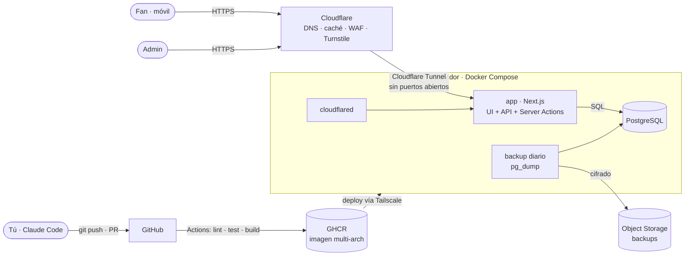

# Dedpuestas — Arquitectura

> Estado: **v0.1** · 24/09/2026 · Decisiones detalladas en [`docs/adr/`](adr/)

## Vista general



## Entornos

| Entorno | Dónde | Para qué | Despliegue |
|---|---|---|---|
| **local** | Tu portátil (Docker Compose) | Desarrollar | `docker compose up` |
| **staging** | Servidor casero (amd64) | Probar antes de publicar | Automático al hacer merge en `main` |
| **production** | Oracle Cloud A1 (arm64, 2 OCPU / 12 GB) | La web pública | Manual: aprobación en GitHub Actions |

Hasta que Oracle apruebe la cuenta, **production vive también en el servidor casero**. Como todo va en contenedores, migrar es cambiar el destino del deploy.

## Componentes

| Componente | Tecnología | Notas |
|---|---|---|
| App | Next.js (App Router) + TypeScript | UI, API y lógica en un solo servicio ([ADR-0001](adr/0001-nextjs-monolito.md)) |
| Estilos | CSS con los tokens de `design/tokens.css` | Nada de colores sueltos en componentes |
| Base de datos | PostgreSQL 17 | Libro de movimientos ([ADR-0002](adr/0002-postgres-libro-de-movimientos.md)) |
| ORM / migraciones | Prisma | Transacciones y `SELECT … FOR UPDATE` con SQL cuando haga falta |
| Auth | Sesiones propias + argon2id | Preparado para Kick/Google ([ADR-0003](adr/0003-auth-usuario-contrasena.md)) |
| Anti-abuso | Cloudflare Turnstile + rate limit | Registro, login y apuestas |
| Entrada | Cloudflare Tunnel | Ningún puerto público ([ADR-0004](adr/0004-entornos-y-despliegue.md)) |
| CI/CD | GitHub Actions + GHCR | Imagen multi-arch (amd64 + arm64) |
| Acceso admin a servidores | Tailscale | SSH solo por la VPN |

## Modelo de datos (primera versión)

```mermaid
erDiagram
  USER ||--o{ AUTH_IDENTITY : "accede con"
  USER ||--o{ SESSION : tiene
  USER ||--o{ LEDGER_ENTRY : "movimientos"
  USER ||--o{ BET : hace
  TEAM ||--o{ PLAYER : agrupa
  PLAYER ||--o{ MARKET : "sobre"
  MARKET ||--|{ OUTCOME : "opciones"
  OUTCOME ||--o{ BET : recibe
  BET ||--o{ LEDGER_ENTRY : genera

  USER { uuid id; text username; text role; timestamptz created_at }
  AUTH_IDENTITY { uuid id; uuid user_id; text provider; text provider_user_id; text password_hash }
  SESSION { text id; uuid user_id; timestamptz expires_at }
  TEAM { text id; text name; text color_token }
  PLAYER { int id; text slug; text nick; text team_id; text kick_channel; text status; bool opted_out }
  MARKET { uuid id; int player_id; text type; text question; timestamptz closes_at; text status; uuid winning_outcome_id; text proof_url }
  OUTCOME { uuid id; uuid market_id; text label; int sort }
  BET { uuid id; uuid user_id; uuid outcome_id; bigint amount; timestamptz created_at }
  LEDGER_ENTRY { bigint id; uuid user_id; bigint delta; text reason; uuid bet_id; uuid market_id; timestamptz created_at }
```

- **`AUTH_IDENTITY` separada de `USER`**: hoy solo `provider = 'password'`; mañana `kick` o `google` sin migrar cuentas.
- **`OUTCOME` genérico**: "Muere/Sobrevive" son 2 filas; un mercado con 6 opciones funciona igual.
- **`PLAYER.status`**: `alive` · `gulag` · `eliminated`.
- **`MARKET.status`**: `open` → `closed` → `resolved` | `void`.
- **Saldo = `SUM(delta)`** del libro. Nunca se guarda un saldo que se pueda editar.
- Todas las fechas en **UTC**; se muestran en la zona horaria del usuario.

## Flujos críticos

### Apostar (HU-11)
En **una transacción**:
1. Bloquear las filas del usuario (`SELECT … FOR UPDATE`) para serializar sus apuestas.
2. Comprobar: mercado `open` y `closes_at > now()`; `amount ≥ 10`; saldo ≥ `amount`.
3. Insertar `BET` y `LEDGER_ENTRY(delta = -amount, reason = 'bet')`.

### Resolver (HU-30)
En **una transacción**, con el mercado bloqueado:
1. `pot = SUM(bets)`, `winners = SUM(bets del outcome ganador)`.
2. Si `winners = 0` o se anula → reembolso: `delta = +amount` a cada apuesta (`reason = 'refund'`).
3. Si no → a cada ganador: `delta = floor(amount × pot / winners)` (`reason = 'payout'`). El resto por redondeo se registra aparte (`reason = 'rounding'`) para que el libro cuadre.
4. `MARKET.status = 'resolved'`, guardar `winning_outcome_id` y `proof_url`.

Resolver dos veces el mismo mercado debe ser imposible (restricción de estado + test).

## Requisitos no funcionales → dónde se cumplen

| RNF | Mecanismo |
|---|---|
| RNF-1 rendimiento | Páginas públicas cacheadas en Cloudflare; k6 en CI de staging |
| RNF-2 consistencia | Transacciones + libro inmutable + tests de concurrencia |
| RNF-3 disponibilidad | Healthcheck `/api/health`, monitor externo, alertas |
| RNF-4 seguridad | Tunnel, Turnstile, rate limit, cabeceras de seguridad, escaneo en CI |
| RNF-5 privacidad | Sin email; secretos en GitHub Secrets / `.env` fuera del repo |
| RNF-8 backups | `pg_dump` diario cifrado a object storage; restauración probada en staging |
| RNF-9 observabilidad | Fase 3: Prometheus + Grafana + Loki |
